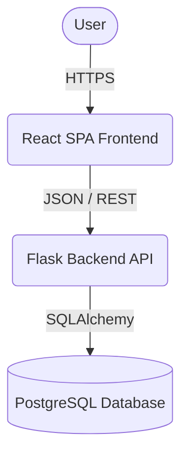
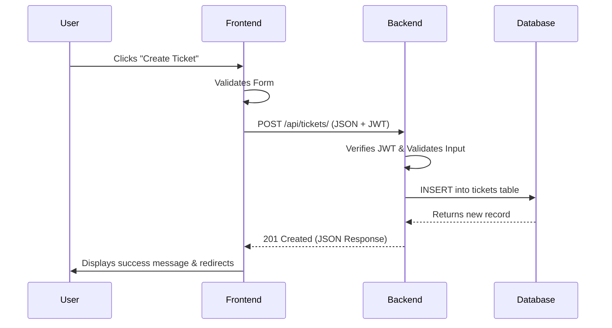
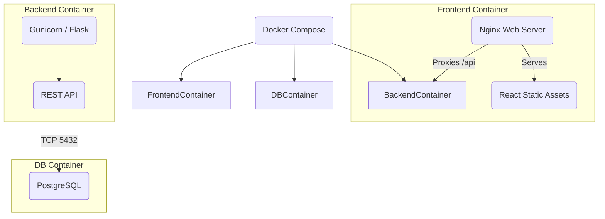

# Architecture Overview

This project implements a modern **Three-Tier Architecture**, cleanly separating the frontend user interface, the backend business logic (REST API), and the database layer.

## Overall System Architecture

## Layered Architecture

1. **Presentation Layer (Frontend)**
   - **Framework**: React 18+ via Vite
   - **UI Library**: Ant Design
   - **Routing**: React Router DOM
   - **Responsibility**: Rendering UI, managing local state, input validation, communicating with the backend via Axios.
   
2. **Application Layer (Backend)**
   - **Framework**: Python 3.x with Flask
   - **Authentication**: JWT (JSON Web Tokens) using Flask-JWT-Extended
   - **Responsibility**: Exposing RESTful endpoints, validating requests, enforcing authorization, applying business logic.

3. **Data Access Layer (Database)**
   - **Database**: PostgreSQL
   - **ORM**: SQLAlchemy
   - **Responsibility**: Persisting users, tickets, comments, and relationships.

## Data Flow

## Container Diagram

