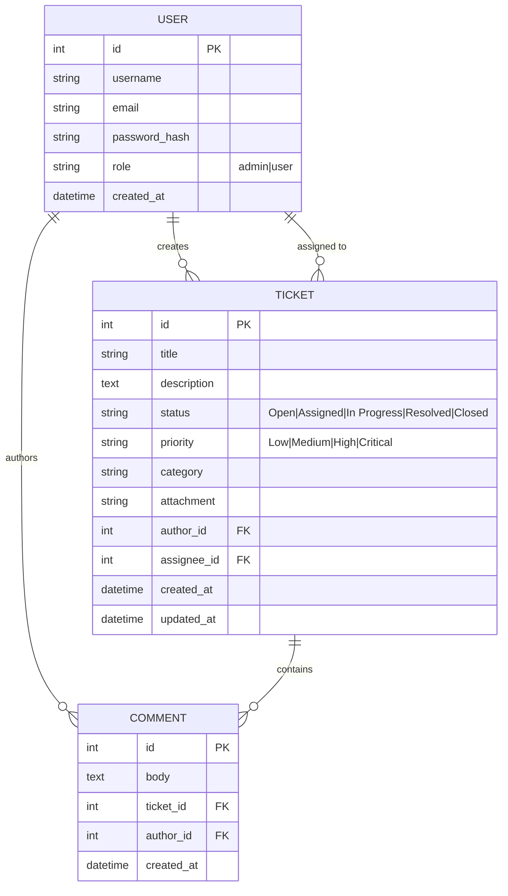

# Database Schema

The database uses PostgreSQL and is mapped using SQLAlchemy.

## ER Diagram

## Indexes and Constraints
- `USER.username` is UNIQUE.
- `USER.email` is UNIQUE.
- Foreign Keys enforce relational integrity.
